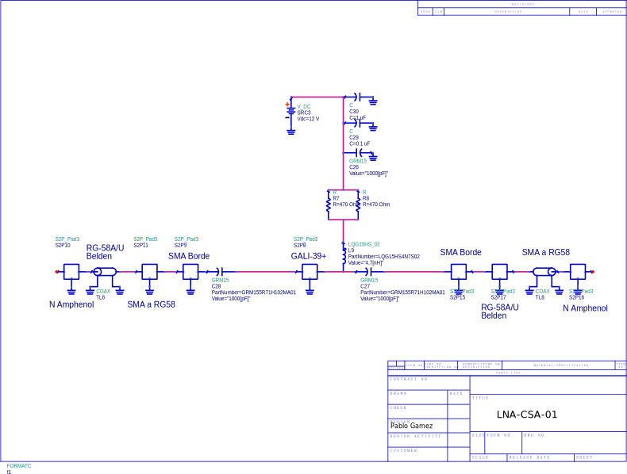

# Información sobre LNA-CSA-01

> **ATENCIÓN** Potencia máxima de entrada +5dBm!!
## Introducción 

El LNA-CSA-01 es un amplificador de RF que emplea el MMIC [GALI-39+](https://www.minicircuits.com/WebStore/dashboard.html?model=Gali-39%2B) de minicircuits. Su ganancia @ 3 GHz es de 15 dB.

## Esquemático

## Mediciones

[Aquí](mediciones/) se incluyen mediciones de parámetros S y punto de compresión.

## Simulación

[Aquí](sim/ADS) se incluye el workspace de ADS utilizado para simulación.

## PCB

[Aquí](pcb/) está el detalle del PCB en KiCAD.

## Fotos del equipo

[Aquí](sim/ADS) se pueden ver fotos del equipo.

