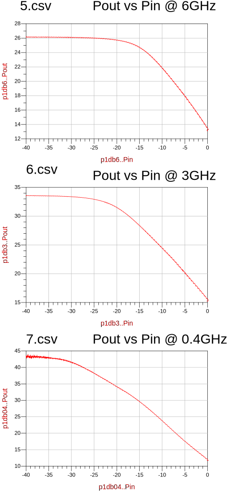

# Detalle de mediciones LNA-CSA-01

## Parámetros S

* **1.s2p** Adapt. SMA-N --> AMP_CSA #1 -> Transición N-N Amphenol --> AMP_CSA #2 --> Adapt. SMA-N
* **2.s2p** AMP_CSA #2
* **3.s2p** AMP_CSA #1
* **4.s2p** Idem **1.s2p** pero con Transición N-N Suhner

## Punto de Compresión

* **5.csv** Barrido en potencia de -40dBm a 0dBm, frec = 6 GHz
* **6.csv** Barrido en potencia de -40dBm a 0dBm, frec = 3 GHz
* **7.csv** Barrido en potencia de -40dBm a 0dBm, frec = 0.4 GHz

