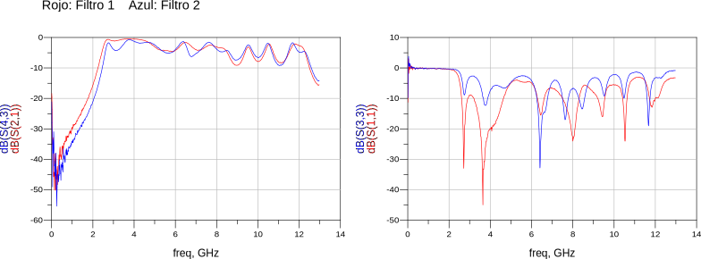
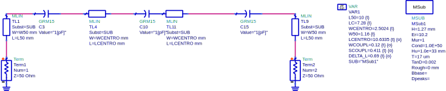

# Filtro pasa-altos HPF-01

En este repo se encuentran los archivos de diseño, simulación y fabricación del filtro.

Se han fabricado dos filtros, que se encuentran rotulados como "1" y "2" en la capa de abajo de sus PCBs.

## Parámetros S

Los parámetros S medidos para los filtros "1" y "2" son:

Se puede acceder a los archivos s2p [aquí](mediciones/s2p)

## Esquemático

Se puede acceder a los esquemáticos [aquí](sch/)

## PCB

Los archivos para fabricación se pueden acceder aquí (pcb/).
Se debe realizar en material Rogers RT6010/d cuya constante dieléctrica es 10.2

## Simulaciones

Se incluye el workspace de simulación de ADS [aquí](sim/ADS)

